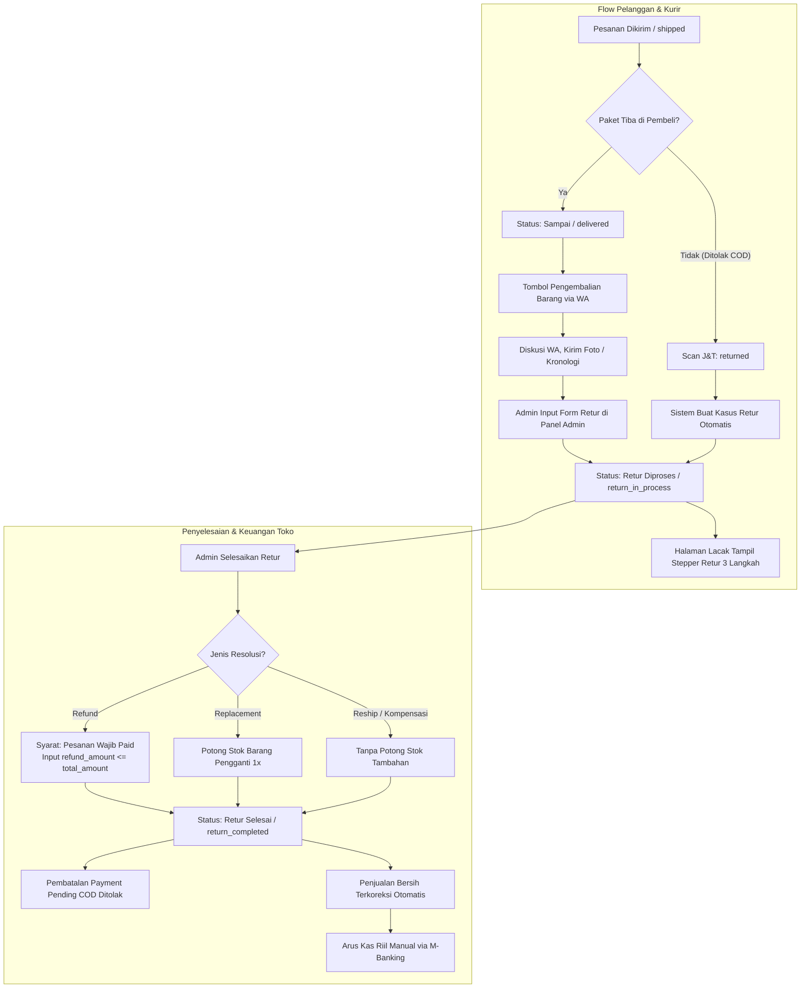

# Fiksasi Alur Retur, Refund, dan Keuangan Toko

Dokumen kanonik arsitektur dan proses bisnis Ragil Aluminium.  
Status: **DIFIKSIKAN & BERLAKU**.  
Tanggal penetapan: 24 September 2026.  
Diselaraskan dengan keputusan owner 19–21 September 2026, implementasi kode backend Laravel 11, view model pelanggan Inertia React, dan laporan performa toko.

---

## 1. Definisi Istilah Sistem

Sebelum istilah teknis digunakan, berikut arti dan fungsinya dalam alur toko:

- **Status Pesanan (`order_status`):** Tahapan perjalanan pesanan di database aplikasi (`orders`), meliputi Dibuat (`pending`), Dikonfirmasi / Menunggu Pembayaran (`awaiting_confirmation`), Diproses (`processing`), Dikirim (`shipped`), Sampai (`delivered`), Selesai (`completed`), Retur Diproses (`return_in_process`), Retur Selesai (`return_completed`), dan Dibatalkan (`cancelled`).
- **Status Pembayaran (`payment_status`):** Status pelunasan dana belanja pelanggan pada pesanan, hanya bernilai Belum Bayar / Menunggu (`pending`) dan Lunas (`paid`).
- **Kasus Retur (`order_return_cases`):** Tabel berkas laporan pengembalian barang yang mencatat alasan, pihak penyebab, status kasus, nilai pengembalian dana, dan biaya kirim pengembalian. Status kasus retur hanya bernilai Terbuka (`open`) dan Selesai (`completed`).
- **Item Retur (`order_return_items`):** Rincian produk dan jumlah unit dalam pesanan yang diajukan untuk dikembalikan (`requested_quantity`) serta jumlah fisik yang benar-benar diterima kembali (`returned_quantity`).
- **Penjualan Gross (`gross_revenue`):** Total seluruh uang belanja yang ditagihkan kepada pembeli pada pesanan yang telah diproses, mencakup harga produk (setelah promo diskon), ongkos kirim pembeli, asuransi, dan biaya layanan Bayar di Tempat (COD), dikurangi nilai voucher toko.
- **Penjualan Bersih (`net_revenue`):** Pendapatan riil hak milik toko setelah Penjualan Gross dikurangi seluruh beban pihak ketiga dan kerugian retur: tagihan aktual kurir J&T, biaya layanan COD kurir, pengembalian dana (*refund*), ongkir retur toko, dan nilai barang yang ditolak kurir.
- **Pembayaran Diterima (`payments_received`):** Total dana kas riil yang telah benar-benar masuk ke toko (dari transfer bank yang terverifikasi dan pesanan COD yang sudah sampai di tangan pembeli).
- **COD Belum Selesai (`cod_outstanding`):** Estimasi nilai tagihan COD dari pesanan yang saat ini masih dalam proses penyiapan atau perjalanan kurir (belum berstatus Sampai).
- **Pengembalian Dana (*Refund*):** Nilai uang yang dikembalikan kepada pembeli atas pesanan lunas yang dibatalkan atau diretur. Di sistem Ragil Aluminium, refund adalah angka pencatatan pengurang laporan keuangan toko, bukan instruksi mutasi otomatis perbankan.
- **Ongkir Retur Toko (`return_shipping_cost`):** Biaya perjalanan kurir untuk mengembalikan barang retur dari alamat pembeli ke workshop/toko yang ditanggung oleh toko sebagai beban operasional.
- **Nilai Barang Retur Paket (`refused_goods_value`):** Total nilai transaksi pesanan COD yang ditolak oleh pembeli saat kurir mengantar, sehingga barang kembali ke gudang toko tanpa pernah ada pembayaran sepeser pun.

---

## 2. PILAR 1: Fiksasi Alur Order Pelanggan (Customer Order Flow)

### 2.1 Pintu Masuk dan Hak Pengajuan Pelanggan
1. **Hanya Berlaku untuk Status Sampai (`delivered`):**
   Pelanggan hanya memiliki hak pengajuan pengembalian barang saat status pesanan telah mencapai Sampai (`delivered`), yaitu saat kurir J&T Cargo telah menyerahkan barang.
2. **Jendela Waktu 48 Jam sebagai Peringatan Kebijakan:**
   Tenggat retur resmi adalah 48 jam terhitung sejak waktu paket tiba (`shipping_records.last_status_at`). Jika batas 48 jam terlampaui, sistem backend tidak memblokir mati pembuatan retur di panel admin, melainkan menampilkan peringatan (*warning*) agar admin dapat mengambil keputusan secara sadar apabila sebelumnya telah ada kesepakatan kompensasi lewat WhatsApp.
3. **Pesanan Selesai (`completed`) Tertutup untuk Retur Sistem:**
   Pesanan yang sudah ditandai Selesai (`completed`) tidak dapat dipindahkan ke alur retur oleh form admin maupun pelanggan. Komplain yang datang setelah pesanan selesai wajib ditangani secara personal melalui komunikasi WhatsApp toko.

### 2.2 Skema Pengajuan: Penuh Manual via WhatsApp (Tanpa Form Publik)
1. **Tidak Ada Form Publik:** Sesuai keputusan owner tanggal 21 September 2026, website toko tidak menyediakan formulir unggah bukti retur publik. Pelanggan tidak dapat mengubah status pesanan secara sepihak.
2. **Tombol "Pengembalian Barang":** Di halaman lacak pesanan publik (`/order-status` / `orders/{order}`), saat pesanan berstatus `delivered`, tampil tombol bergaris tepi merah (*outline*) redup bertuliskan "Pengembalian Barang".
3. **Penyambung Percakapan:** Menekan tombol tersebut akan membuka tautan WhatsApp resmi toko (`return_whatsapp_url`) dengan format pesan otomatis memuat nomor pesanan (naskah template `order_return`). Pelanggan berdiskusi, mengirimkan foto fisik, video unboxing, serta kronologi kendala langsung ke admin.

### 2.3 Pencatatan Kasus oleh Admin di Panel Toko
Setelah admin dan pelanggan mencapai kesepakatan di WhatsApp, admin mencatat kasus retur secara resmi:
1. Admin membuka halaman detail pesanan di `/admin/orders/{order}`.
2. Admin mengisi formulir pencatatan retur:
   - Alasan retur (`rusak`, `pecah`, `salah_ukuran`, `salah_produk`, `kurang`, `lainnya`).
   - Catatan keluhan pelanggan (`customer_notes` - wajib diisi).
   - Pihak penyebab kesalahan (`fault_party`: `store`, `customer`, `other`).
   - Beban ongkir retur (`shipping_cost_borne_by_store`).
   - Rincian item dan unit barang yang diretur (bisa retur sebagian atau retur penuh).
3. Saat formulir disimpan:
   - Dibuat 1 baris kasus retur di `order_return_cases` dengan status Terbuka (`open`).
   - Status pesanan berpindah dari `delivered` menjadi **Retur Diproses (`return_in_process`)**.
   - Pelanggan menerima pesan WhatsApp konfirmasi tindak lanjut retur (`order_issue_followup`).

### 2.4 Jalur Otomatis Kurir (Paket COD Ditolak Sebelum Diterima)
1. Apabila kurir J&T Cargo menginput status gagal antar / paket ditolak pembeli (kode scan `returned` / scanType 12 / scanTypeCode 101), webhook J&T atau penyegaran pelacakan sistem akan menerima status tersebut.
2. Status pengiriman pesanan berubah menjadi `returned`, dan status pesanan otomatis berpindah ke **`return_in_process`**.
3. Sistem melalui fungsi `openRefusedReturnCase()` secara otomatis membuka kasus retur dengan alasan `ditolak` dan catatan otomatis "Paket dikembalikan ke pengirim oleh kurir."

### 2.5 Pengalaman Antarmuka yang Dilihat Pelanggan Saat Retur Aktif
Begitu pesanan berstatus `return_in_process` atau `return_completed`:
1. **Lencana Status:** Menampilkan status "Retur diproses" (latar kuning peringatan) atau "Retur selesai" (latar hijau sukses).
2. **Penggantian Stepper Pelacakan:** Stepper standar 4 tahap pengiriman (Dikonfirmasi -> Disiapkan -> Dikirim -> Selesai) **dihilangkan**, digantikan sepenuhnya oleh Alur Retur 3 Langkah (`order.vm.returnFlow`):
   - Langkah 1: **Pengembalian diterima** (merekam tanggal kasus retur tercatat).
   - Langkah 2: **Sedang ditangani** (tahap pemeriksaan barang / administrasi toko).
   - Langkah 3: **Selesai** (tahap penyelesaian akhir kasus).
3. **Pembersihan Kontrol:** Tombol "Pengembalian Barang" dan formulir "Beri Ulasan" otomatis disembunyikan.

### 2.6 Penyelesaian Kasus dan Sifat Terminal
1. Admin menyelesaikan kasus retur melalui panel admin dengan memilih resolusi:
   - Pengembalian dana (`refund`).
   - Penggantian barang baru (`replacement`).
   - Pengiriman ulang barang yang sama (`reship`).
   - Kompensasi solusi lain (`compensation`).
   - Tanpa kompensasi (`no_compensation`).
2. Setelah disimpan:
   - Status kasus retur menjadi **`completed`** (`completed_at` terisi).
   - Status pesanan berpindah menjadi **Retur Selesai (`return_completed`)**.
   - Pesan WhatsApp konfirmasi penyelesaian retur (`order_returned`) dikirim ke nomor pembeli.
3. **Status `return_completed` Bersifat Terminal:** Pesanan yang telah mencapai status ini terkunci permanen. Tidak dapat diretur ulang, tidak dapat dibatalkan, dan tidak dapat diubah statusnya lagi.

---

## 3. PILAR 2: Fiksasi Alur Keuangan Toko (Store Finance & Accounting Flow)

### 3.1 Prinsip Pemisahan: Penjualan Bersih vs Arus Kas Nyata
Sistem keuangan Ragil Aluminium memisahkan dua konsep yang sering disalahartikan:
1. **Penjualan Bersih (*Net Revenue*):** Hak ekonomi toko atas barang yang telah diproses dan dikirimkan setelah dikurangi seluruh biaya pihak ketiga dan kerugian retur. Penjualan diakui sejak pesanan masuk tahap Diproses (`processing`).
2. **Arus Kas / Pembayaran Diterima (*Payments Received*):** Uang riil yang sudah benar-benar masuk ke rekening kas/bank toko.

Kedua angka ini tidak selalu sama dalam satu periode berjalan karena adanya jeda pelunasan COD kurir dan pesanan transfer yang baru dibayar.

### 3.2 Rumus Pembentukan Penjualan Gross
Penjualan Gross mengukur total nilai transaksi yang disepakati pembeli saat checkout:

$$\text{Penjualan Gross} = \text{Nilai Produk (Promo)} - \text{Voucher Toko} + \text{Ongkir Pembeli} + \text{Asuransi} + \text{Biaya COD Pembeli}$$

- Diskon potongan harga produk langsung memotong nilai jual barang sejak awal, bukan pos pengurang gross.
- Voucher toko benar-benar memotong tagihan belanja, sehingga mengurangi gross.
- Ongkir dan biaya penanganan COD yang dibayar pembeli dicatat ke gross karena merupakan bagian dari total tagihan invoice.

### 3.3 Rumus Penjualan Bersih Toko (Gross ke Bersih)
Penjualan Bersih dihitung dengan mengeluarkan dana pihak ketiga dan kerugian retur dari Penjualan Gross:

$$\text{Penjualan Bersih} = \text{Penjualan Gross} - \text{Tagihan J&T} - \text{Biaya COD ke J&T} - \text{Refund Retur} - \text{Ongkir Retur Toko} - \text{Nilai Barang Retur Paket}$$

Keterangan pos pengurang toko:
1. **Tagihan J&T:** Ongkos kirim riil yang ditagihkan oleh J&T Cargo (subsidi ongkir yang diberikan toko ke pembeli sudah otomatis tercermin di sini).
2. **Biaya COD ke J&T:** Persentase biaya penanganan kurir yang disetor ke J&T Cargo.
3. **Refund Retur (`refund_amount`):** Dana yang dikembalikan toko kepada pembeli atas pesanan retur.
4. **Ongkir Retur Toko (`return_shipping_cost`):** Biaya pengiriman balik barang retur yang ditanggung toko akibat barang rusak, salah kirim, atau kebijakan toko. Pos ini **mengurangi Penjualan Bersih**.
5. **Nilai Barang Retur Paket (`refused_goods_value`):** Khusus paket COD yang ditolak kurir sebelum sampai. Karena barang tidak pernah dibayar pembeli dan tidak ada uang masuk, nilai total pesanannya dikeluarkan dari Penjualan Bersih agar laporan laba tidak mencatat pendapatan fiktif.

### 3.4 Garis Waktu Uang & Pelunasan Pesanan Bayar di Tempat (COD)
Pergerakan status pembayaran pesanan COD:
1. **Pesanan Dibuat hingga Dikirim:** Status pesanan bertahap dari `pending` ke `shipped`. Status pembayaran (`orders.payment_status`) tetap **`pending`**, dan baris pembayaran di tabel `payments` berstatus `pending`.
2. **Titik Pelunasan (Paket Sampai):** Saat paket dinyatakan tiba oleh kurir (`delivered`), fungsi sistem `markDeliveredAndSettleCod()` bekerja otomatis:
   - Baris pembayaran COD diubah menjadi Selesai (`completed`) dengan waktu lunas (`paid_at`) dicatat sesuai waktu paket tiba.
   - Status pembayaran pesanan (`orders.payment_status`) berubah menjadi Lunas (**`paid`**).
   - Penjualan resmi terhitung telah melunasi kas.
3. **Kasus Paket COD Ditolak Kurir:**
   - Paket tidak pernah mencapai status `delivered`, sehingga pelunasan COD **tidak pernah terjadi**.
   - Status pembayaran tetap `pending`.
   - **TIDAK ADA UANG MASUK KE TOKO, DAN TIDAK ADA REFUND KEPADA PEMBELI.**
   - Toko menanggung rugi ongkos kirim dan biaya penanganan yang hangus di kurir.
   - Saat admin menyelesaikan kasus retur pesanan yang ditolak ini, baris pembayaran `pending` di tabel `payments` otomatis dibatalkan (`status = cancelled`) melalui fungsi `cancelPendingForReturnCompleted()`. Hal ini mencegah pesanan menggantung selamanya sebagai tagihan piutang di laporan toko.

### 3.5 Hakikat Refund: Pembatasan dan Tanpa Kas Otomatis
1. **Refund Hanya Sah untuk Pesanan Lunas:** Formulir penyelesaian retur admin melarang pemberian refund (`resolution_type = refund`) jika pesanan belum lunas (`payment_status !== 'paid'`). Pesanan yang tidak pernah dibayar (seperti COD ditolak) tidak boleh diberi refund karena akan memotong laba toko atas uang yang tidak pernah diterima.
2. **Batas Maksimal Refund:** Nominal `refund_amount` tidak boleh melebihi nilai total belanja pesanan (`orders.total_amount`).
3. **Bukan Mutasi Perbankan Otomatis:** Sistem web Ragil Aluminium tidak memiliki integrasi pengeluaran kas bank otomatis (*disbursement API*). Pengembalian uang riil ke rekening pembeli dilakukan secara manual oleh owner/bendahara toko via m-Banking atau transfer bank langsung. Pengisian `refund_amount` di admin berfungsi sebagai dokumen audit dan pengurang agregat laporan keuangan.

### 3.6 Perlakuan Stok Barang Retur (Aturan Non-Negotiable)
1. **Barang Retur TIDAK Otomatis Menambah Stok (Keputusan Owner 19 Sep 2026):**
   Unit produk yang dikembalikan pembeli atau kurir tidak dikembalikan ke stok katalog (`products.stock` / `product_variants.stock`). Barang retur harus diperiksa fisik di workshop untuk memastikan kelayakan atau perbaikan. Admin yang berwenang yang dapat menambahkan stok kembali secara sadar lewat menu edit produk.
2. **Penggantian Barang Baru (`replacement`):**
   Apabila kasus retur diselesaikan dengan resolusi penggantian barang, sistem otomatis memotong stok barang pengganti sebanyak 1 kali (`decrement`) dari stok gudang toko.
3. **Pengiriman Ulang (`reship`):**
   Resolusi kirim ulang tidak memotong stok lagi karena menggunakan unit barang yang sebelumnya sudah disiapkan untuk pesanan tersebut.

---

## 4. Diagram Alur Terpadu (Flowchart)

---

## 5. Matriks Ringkasan Dampak Retur terhadap Keuangan & Sistem

| Skenario Retur | Status Pesanan Akhir | Status Pembayaran | Efek ke Penjualan Gross | Efek ke Penjualan Bersih | Efek ke Arus Kas Toko | Efek ke Stok Barang |
|---|---|---|---|---|---|---|
| **Retur Refund (Transfer / COD Lunas)** | `return_completed` | `paid` | Tetap | Berkurang sebesar `refund_amount` + ongkir retur toko | Kas keluar manual via transfer bank (dicatat di luar sistem) | Barang retur tidak kembali ke stok sistem |
| **Retur Penggantian Barang (`replacement`)** | `return_completed` | `paid` | Tetap | Berkurang sebesar ongkir retur toko | Tidak ada uang keluar ke pembeli | Stok unit pengganti berkurang 1x |
| **Paket Ditolak Kurir (COD Belum Lunas)** | `return_completed` | `pending` (baris payment `cancelled`) | Tetap | Berkurang sebesar nilai produk retur + ongkir retur toko | Tidak ada uang masuk & tidak ada refund keluar | Barang retur fisik kembali ke gudang tanpa restore stok |
| **Retur Kirim Ulang (`reship`)** | `return_completed` | `paid` | Tetap | Berkurang sebesar ongkir retur toko bila ditanggung | Tidak ada uang keluar | Stok tidak berubah |

---

## 6. Verifikasi & Integritas Sistem

Penerapan fiksasi ini telah diuji dan diverifikasi langsung pada backend serta frontend repositori:
1. **Uji Kasus Retur Lolos Penuh:** Seluruh pengujian fitur alur retur (`AdminReturnWorkflowTest`, `ReturnServiceTest`, `OrderReturnCtaTest`, `StorePerformanceRefusedReturnTest`) lulus 100%.
2. **Penjaga Validasi Refund:** Pengujian unit otomatis mengunci bahwa pesanan belum lunas (`payment_status !== 'paid'`) ditolak saat mencoba diproses refund.
3. **Penyelarasan Teks Antarmuka:** Keterangan tooltip biaya ongkir retur toko pada `resources/js/pages/Admin/Orders/Show.tsx` telah diselaraskan: menyatakan dengan benar bahwa ongkos retur yang ditanggung toko mengurangi Penjualan Bersih.
4. **Bebas Karakter Terlarang:** Dokumen dan kode 100% bebas dari karakter *em dash* (U+2014).
