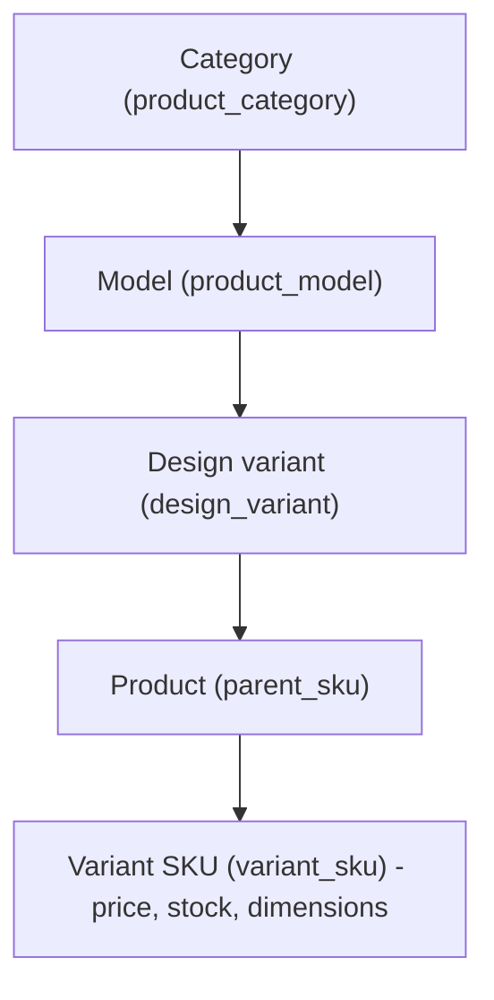
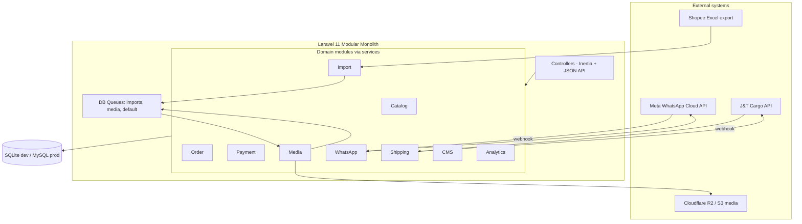

# Ragil Aluminium — Product Handoff (UI Rebuild Edition)

> **Purpose of this document.** This is a self-contained handoff for an agent tasked with building a **fresh UI** for Ragil Aluminium. It describes *what* the product is, *who* it serves, the *backend*, *architecture*, *data*, *workflows*, *features*, and the *functional contract of every page* — but it deliberately **excludes all visual design** (colors, typography, spacing, Figma/Relume references, component styling, layout pixels). You have full freedom over the look and feel. You must **not** change routes, route names, data contracts, database schema, or enums.
>
> Language note: the product and its copy are **Indonesian**. Domain terms (Jendela, Pintu, Bouven, Ulasan, etc.) are preserved throughout. Keep user-facing copy in Bahasa Indonesia.

---

## 1. What is Ragil Aluminium

Ragil Aluminium is an **Indonesian e-commerce platform for aluminium building/fenestration products** — primarily windows (jendela), doors (pintu), and bouven (top-mounted windows above a door/window opening). Customers browse a catalog, configure product variants (size/design), and place orders with nationwide shipping and COD/bank-transfer payment.

The website is **not a standalone store** — it is the **transaction engine** at the center of a multi-channel operation:

| Channel | Role | Direction |
|---------|------|-----------|
| **Shopee** | Upstream source of the official catalog and SKUs. Catalog enters the website via Shopee "Mass Upload/Update" Excel exports. | Shopee → Website (website never writes back to Shopee) |
| **Website** | Primary transaction engine: catalog display, cart, checkout, order of record, order-status tracking. | — |
| **WhatsApp Business** | Post-order notifications and customer communication (payment proof, shipping updates, support). Orders are **not** created here. | Website ↔ Customer |
| **J&T Cargo** | Shipping cost estimation, waybill creation, and authoritative shipping status (via API + webhook). | Website ↔ J&T |
| **Cloud storage (Cloudflare R2 / local)** | Product image CDN after images are downloaded from Shopee URLs. | — |

**Guiding principles baked into the product:**
- **Product public IDs** live in columns `parent_sku` / `variant_sku` (opaque URL keys). **Never show these codes on the storefront** (cards, PDP, cart, model pages). Customers see name + options only. Admin/import/orders may show them as **Kode produk**.
- **Shopee import** maps `SP{product_id}` (and variant suffixes) into those columns — Shopee remains upstream for imported rows. Website never writes back to Shopee.
- **Website-created products** get a **random opaque** public ID with configurable prefix (`storefront.manual_sku_prefix`, default `WEB`) via `ShopeeStyleSku::nextParentSku()` — not a sequential catalog number and not a customer-facing “SKU label”.
- **Product name (Shopee / admin)** follows the live Shopee title pattern, e.g.  
  `Jendela Aluminium 3 Daun Swing Casement Ornamen Tinggi 200 cm x Panjang 160 cm (200x160)`.  
  Older sample XLSX title layouts are **not** the naming SoT. Import stores `name` as-is; taxonomy/dimensions are parsed from the title.
- **Public ID vs content:** category/model/design, name, photos, and variant options are editable under the same ID. Reusing one ID for a completely different physical product is allowed technically but should prefer archive + new product for ops clarity. Edit-in-place impact (same URL, new content) is accepted.
- **Archive, never hard-delete.** Catalog/media/orders use status/visibility flags.
- **Guest checkout only.** Customers never create accounts or log in. Only admins log in.
- **Bulk catalog changes go through the import pipeline**, never ad-hoc.
- **Graceful degradation.** WhatsApp and J&T work without live credentials in dev (no crashes, no partial writes).

---

## 2. Who it's for

There are effectively three actors (see `skills/stage-2-actors-and-roles.md`).

### 2.1 Customers (guest, no login)
Indonesian homeowners and contractors who:
- Browse the catalog by category (Window / Door / Bouven) and model.
- Open a product detail page, choose a variant, and read specs/reviews.
- Add items to a session cart and check out **as a guest** (name, phone, address).
- Track their order by **order number** and **phone number**.
- Communicate and receive updates primarily via **WhatsApp**.

### 2.2 Store admins / staff (login required)
Internal team members who operate everything under `/admin`:
- Import catalog from Shopee Excel; manage products, variants, attributes, media.
- Process orders, record payments, manage shipping/waybills.
- Manage CMS content (homepage banners, pages, testimonials).
- Configure WhatsApp templates and review the message log.
- View analytics (store performance, import performance) and manage admin users/settings.

Roles column exists (`users.role`) but **Stage 2 equal-admin** applies: every dashboard user is Store Admin with the same technical access. Canonical stored value is `admin`. There is no Super Admin / Staff / Viewer hierarchy in UI or middleware — login gate is authenticated + `status=active` only.

### 2.3 System / worker
Queue workers and scheduled/console commands that run imports, media downloads, and dispatch WhatsApp notifications asynchronously.

---

## 3. Product catalog model (taxonomy)

The catalog uses a **3-layer taxonomy** for navigation, layered on top of Shopee SKUs.



| Layer | Field | Enum values |
|-------|-------|-------------|
| Category | `product_category` | `WINDOW` (Jendela), `DOOR` (Pintu), `BOUVEN` |
| Model | `product_model` | `JUNGKIT` (awning/tilt), `SLIDING`, `SWING`, `KACA_MATI` (fixed glass), `ZIGZAG` (folding) |
| Design | `design_variant` | `POLOS`, `ORNAMEN`, `KOMBINASI`, `SERIES_A`, `SERIES_B`, `SERIES_C` |

- **Category vs model:** tidak ada “jendela boven”. Kategori saling eksklusif (`WINDOW` | `DOOR` | `BOUVEN`). Model (mis. `JUNGKIT`) boleh ada di jendela **dan** boven sebagai dua baris produk berbeda.
- **Shopee Excel** tidak punya kolom kategori terisi; import (`ShopeeCatalogTaxonomy::fromProductName`) baca judul: kata `Boven`/`Bouven` → `BOUVEN` (meski diawali “Jendela …”); `Pintu` → `DOOR`; `Jendela` tanpa Boven → `WINDOW`. Model/desain dari kata Jungkit/Sliding/… dan Polos/Ornamen/….
- **Media:** cover storefront dari `mass_update_media_info` (`ShopeeMediaExport`). Re-import **mengganti** foto utama sesuai cover file dan menyembunyikan URL katalog lama yang tidak ada di file (cegah foto boven nempel di jendela). Perbaiki data existing: `php artisan catalog:resync-shopee-media --download`.
- Reparse taxonomy tanpa re-upload: `php artisan catalog:reparse-taxonomy` (`--dry-run` tersedia).

- A **Product** (`products.parent_sku`) is the parent item; it holds category/model/design and marketing fields.
- A **Variant** (`product_variants.variant_sku`) is the sellable unit with `price`, `stock`, `weight_kg`, and dimensions (`width_cm`, `height_cm`, `depth_cm`), plus up to two variation axes (e.g. "Ukuran" / "Warna").
- Interior items and unrelated accessories are **out of initial scope**.
- "Popular": Catalog `?sort=popular` = sum of website `order_items.quantity`; Home "Paling Banyak Dipesan" strip = maksimal 10 produk nyata yang dipilih admin melalui `homepage_popular`, diurutkan oleh `homepage_popular_sort`.

---

## 4. System architecture

Ragil Aluminium is a **Laravel 11 modular monolith**: one deployable app with internal modules that communicate through **services**, **domain events**, and documented routes — not microservices. The frontend is delivered through **Inertia.js + React** (single-page-app feel, server-driven props). Bulk/async work runs on **database queues**.



**Ten modules** (see `docs/architecture/system-architecture-ragil-aluminium.md` and `skills/stage-3-modules.md`):

1. **Catalog** — products, variants, attributes, taxonomy; owns pricing/stock display data.
2. **Order** — session cart → orders/order_items; order lifecycle owner.
3. **Payment** — payment records; drives the order forward on confirmation.
4. **Shipping** — shipping records; J&T integration; cascades `orders.shipping_status`.
5. **Import** — Shopee Excel pipeline; the only path for bulk catalog changes.
6. **Media** — download/store images; expose `stored_url` + WebP derivatives.
7. **WhatsApp** — templates + message log; event-driven notifications; never mutates business state.
8. **Admin UI** — `/admin` operational frontend over domain services.
9. **Public UI** — customer catalog/cart/checkout/status.
10. **Cross-cutting** — users, customers, event logs, performance metrics.

**Architectural constraints:**
- No cross-module direct table access; go through the owning service.
- Guest-only checkout; customer data is **snapshotted** onto `orders` at order time.
- WhatsApp is the primary async notification channel (no email/password customer accounts).
- Price/stock are re-validated from the DB at order time — the session cart is never trusted for final pricing.
- The same public controllers serve **both** Inertia HTML pages and JSON (API) responses.

---

## 5. Tech stack

### Backend (`composer.json`)
| Component | Version / package |
|-----------|-------------------|
| PHP | `^8.2` (requires `ext-gd` for media derivatives) |
| Laravel | `^11.31` |
| Inertia (server) | `inertiajs/inertia-laravel ^3.1` |
| Auth | `laravel/sanctum ^4.3` (installed; admin uses **session** auth) |
| Excel import | `maatwebsite/excel ^3.1` (PhpSpreadsheet) |
| Object storage | `league/flysystem-aws-s3-v3 ^3.29` (R2 / S3) |
| Testing | PHPUnit `^11` |

### Frontend (`package.json`)
| Component | Version |
|-----------|---------|
| Build | Vite 6 + `laravel-vite-plugin` |
| UI framework | React 18 + TypeScript |
| SPA bridge | `@inertiajs/react ^2.0` |
| Styling | Tailwind CSS 3 (+ Radix UI primitives currently) |
| HTTP client | Axios |

### Rendering model
- Controllers return `Inertia::render('Page/Name', $props)`.
- React pages live under `resources/js/pages/` (e.g. `Public/*`, `Admin/*`).
- One root Blade shell: `resources/views/app.blade.php`.
- Shared props injected by `app/Http/Middleware/HandleInertiaRequests.php`: auth user, flash messages, cart count, cart preview (`cartPreview`: up to 5 cart lines with name, variation, qty, unit price, main-image thumb for the header hover panel), brand config, navigation, active announcements.
- Legacy Blade views still exist but are **not** the active render path (archived per `docs/MEMORY.md`).

> **For the UI rebuild:** you are replacing the React pages/components. Keep the Inertia contract — controllers pass the same props (see the page inventory in §10). You may restructure components, styles, and layouts freely.

### Infrastructure defaults (`config/*`, `.env.example`)
- **DB:** SQLite by default (`database/database.sqlite`); MySQL for production.
- **Session / cache / queue:** `database` driver. Queues: `imports`, `media`, `default`.
- **Filesystem:** `local` default; `media` disk switches to R2/S3 via `MEDIA_DISK=s3`. Imports stored on `imports` disk (`storage/app/imports`).
- **External env groups:** `WHATSAPP_*`, `JNT_*`, `AWS_*`/`MEDIA_*`, `SHIPPING_LOCAL_*`.

---

## 6. Data model

23 Eloquent models under `app/Models/`. Full field lists live in [`docs/database-schema-ragil-aluminium.md`](database-schema-ragil-aluminium.md) (canonical). Summary below groups by domain with the enums/statuses the UI must respect.

### 6.1 Catalog
- **`Product`** — parent product. Key fields: `parent_sku` (unique opaque public ID + URL segment `/product/{parent_sku}` — **not shown on storefront**), `name`, `short_name`, `description`, `category_id`, `product_category`, `product_model`, `design_variant`, `status` (`active`/`inactive`/`archived`/`draft`), `homepage_popular`, `homepage_popular_sort`. Relations: `variants`, `activeVariants`, `attributes`, `media`, `mainImage`, `orderItems`, `testimonials`. Scopes: `visible`, `category`, `homepagePopular`, `orderByWebsiteSales`. Has `toApiArray()`.
- **`ProductVariant`** — sellable unit. Fields: `variant_sku` (unique opaque ID for cart/order lines — **not shown on storefront**), `variation_1_name/option`, `variation_2_name/option`, `price`, `stock`, `weight_kg`, `width_cm`, `height_cm`, `depth_cm`, `status` (`active`/`inactive`/`archived`). Computed `in_stock`; has `toApiArray()`.
- **`ProductAttribute`** — key/value specs at product or variant level. `attribute_name`, `attribute_value`, `source` (`shopee`/`internal`).

### 6.2 Media
- **`ProductMedia`** — image pipeline record. `position` (1–9), `is_main_image`, `show_in_catalog` (PDP/card gallery), `is_installation` (Hasil Pemasangan aggregate), `visibility` (`visible`/`archived`/`hidden`), `source_url` (ingest archive only), `stored_path`, `stored_url`, `derivatives` (JSON: `thumb`/`card`/`pdp` WebP), `mime_type`, `size_bytes`, `width_px`, `height_px`, `status` (`pending`/`downloading`/`downloaded`/`failed`), `error_reason`. Methods: `urlFor('thumb'|'card'|'pdp')`, `display_url`, `srcsetForCard()`. Import: `image_1..9` catalog; optional `installation_slots`; `installation_image_1..9` installation-only.
  - **UI rule:** display images via `urlFor()`/`display_url` (derivatives). Never hotlink `source_url` in production.

### 6.3 Orders & commerce
- **`Order`** — lifecycle master with customer/shipping snapshot. `order_number` (unique, format `RA-YYMMDD-XXXXXX`), `checkout_idempotency_key` (nullable unique UUID for session retry/double-submit protection), customer contact/address fields (`shipping_address_line1/2`, `shipping_city`, `shipping_province`, `shipping_district`, `shipping_village`, `shipping_postal_code`, `shipping_country`), tri-status:
  - `order_status`: `pending_payment`, `processing`, `shipped`, `delivered`, `completed`, `issue`, `return_in_process`, `cancelled`
  - `payment_status`: `pending`, `paid`, `refunded`
  - `shipping_status`: `pending_pickup`, `in_process`, `in_transit`, `delivered`, `cancelled`
  - Amounts: `subtotal_amount`, `shipping_amount`, `discount_amount`, `total_amount`. `payment_method`: `cod`/`transfer`/`other`; `cod_flag`; `notes`. Relations: `customer`, `items`, `payments`, `shippingRecords`, `whatsappMessages`. Scopes: `pendingPayment`, `needsAttention`.
- **`OrderItem`** — immutable line snapshot: `parent_sku`, `variant_sku`, `name`, variation fields, `unit_price`, `quantity`, `line_subtotal`, `line_discount`, `line_total`.
- **`Payment`** — `payment_method` (`cod`/`transfer`/`gateway`), `amount`, `status` (`pending`/`completed`/`failed`/`refunded`), `transaction_reference`, `evidence_url`, `paid_at`.
- **`Customer`** — optional reusable profile keyed by unique `phone`; order snapshots remain authoritative per order.
- **`ShippingRecord`** — `carrier_name`, `service_name`, `waybill_number` (unique), `shipping_cost`, `status` (`pending_pickup`/`in_process`/`in_transit`/`delivered`/`returned`/`cancelled`), `status_raw`, `last_status_at`, `tracking_url`.

### 6.4 Import pipeline
- **`ImportJob`** — `type` (`shopee_mass_upload`/`shopee_mass_update`/`internal_bulk_update`), `source_file_name/path`, row counters (`total_rows`, `processed_rows`, `success_rows`, `failed_rows`), `status` (`pending`/`running`/`completed`/`failed`), `global_error_message`, `triggered_by_user_id`. Relations: `rows`, `failedRows`, `media`.
- **`ImportJobRow`** — `row_number`, `raw_data` (JSON), `status` (`pending`/`processed`/`success`/`failed`), `error_reason`, `linked_product_id`, `linked_product_variant_id`, `processed_at`.

### 6.5 WhatsApp
- **`WhatsAppTemplate`** — `internal_key` (unique), `provider_template_name`, `language_code` (default `id`), `category` (`transactional`/`marketing`/`otp`), `status` (`active`/`inactive`). Common keys: `order_created`, `payment_confirmed`, `order_shipped`, `order_delivered`, `order_returned`, `order_issue_followup`, `consultation_request` (public konsultasi CTA).
- **`WhatsAppMessage`** — `direction` (`outbound`/`inbound`), `order_id`, `phone_number`, `internal_template_key`, `provider_message_id`, `content_text`, `content_payload`, `status` (`pending`/`sent`/`delivered`/`read`/`failed`/`received`), `error_reason`, `sent_at`, `received_at`, `raw_payload`.

### 6.6 CMS
- **`CmsPage`** — `slug`, `title`, `content` (JSON blob), `published`. Owns `faqItems`, `problemsSolutions`, `galleryItems`, `testimonials`.
- **`CmsBanner`** — homepage carousel: `title`, `image_url`, `link_url` (internal `/product/{parent_sku}` or full URL), `sort_order`, `published`. If linked to a product, the product's main media replaces `image_url` at render time.
- **`CmsModelProduct`** — storefront model showcase cards: `name`, `product_category`/`product_model` (catalog link), `image_url`, `type` (`polos`/`ornamen`/`lainnya`), `status` (`active`/`draft`), `sort_order`.
- **`CmsTestimonial`** — `product_id` (nullable → PDP "Ulasan" tab when set, else `/reviews` only), `customer_name`, `message`, `rating` (1–5), `source` (`shopee`/`whatsapp`/`website`/`other`), `location`, `image_url`, `published`, `sort_order`. Has `toPublicArray()`.
- **`CmsFaqItem`**, **`CmsGalleryItem`** (manual hasil-pemasangan without SKU; page also aggregates `product_media.is_installation`), **`CmsProblemSolution`** — structured blocks attached to `CmsPage`.
- **`CmsModelProduct`** — "Model produk" hub cards for the taxonomy showcase (separate from catalog `Product`).

### 6.7 Auth & analytics
- **`User`** — admin/staff. Canonical `role` = `admin` (Stage 2 equal-admin; other enum values legacy/normalized). `status` (`active`/`inactive`). Methods `isActive()`, `isAdmin()` (always true for `users` rows).
- **`EventLog`** — append-only domain audit trail (`event_type`, `entity_type`, `entity_id`, `payload`).
- **`PerformanceMetric`** — daily aggregated KPIs for analytics.

---

## 7. Backend surface

### 7.1 Controllers (`app/Http/Controllers/`)
All page controllers return **Inertia** responses unless noted; public catalog/product/search/order controllers also branch to **JSON** when `request()->is('api/*')` or `Accept: application/json`.

**Public storefront**
| Controller | Responsibility |
|-----------|----------------|
| `HomeController` | Homepage: banners, popular products, promotions, testimonials |
| `PageController` | `/about`, `/faq`, `/contact`, `/cara-pemesanan`, `/policy/*`, `/reviews` (CMS/static) |
| `CatalogController` | `/products` (model hub), `/products/{category}`, `/products/{category}/{model}`, `/products/{category}/{model}/{design}` |
| `ProductController` | `/product/{parent_sku}` PDP with variants, media, attributes, testimonials |
| `SearchController` | `GET /api/search` — JSON SKU/name search (storefront memakai `/products?q=`) |
| `CartController` | Session cart CRUD; `count` returns JSON |
| `CheckoutController` | Validate details, estimate shipping, place order |
| `OrderController` | Confirmation, order-status lookup (HTML + API), order count JSON |

**Auth:** `Auth\LoginController` — admin session login (throttled), logout.

**Admin (`Admin/` namespace, `auth` + `admin` middleware):** `DashboardController`, `ProductController`, `ProductVariantController`, `ProductAttributeController`, `ProductMediaController`, `ImportJobController`, `OrderController`, `PaymentController`, `ShippingRecordController`, `WhatsAppTemplateController`, `WhatsAppMessageController`, `AnalyticsController`, `BerandaController`, `ModelProductController`, `CaraPemesananController`, `FaqController`, `MasalahSolusiController`, `TentangKamiController`, `KetentuanLayananController`, `KebijakanPrivasiController`, `PageController` (CMS + branding), `BannerController`, `TestimonialController`, `GalleryItemController`, `ActivityLogController`, `ProfileController`, `UserController`, `SettingsController`.

**Webhooks (CSRF-exempt, throttle 120/min):** `Webhook\WhatsAppController` (verify + handle), `Webhook\ShippingController` (J&T push).

### 7.2 Services (`app/Services/`)
| Service | Role |
|---------|------|
| `CartService` | Session cart (`ragil_cart` key): add/update/remove, subtotal, count |
| `OrderService` | `createFromCart()` — DB revalidation, unique checkout idempotency key, stock lock/decrement, create order+items+payment; `cancel()` restores variant stock exactly once under order lock |
| `PaymentService` | Locks order/payments, requires positive amounts and full completed settlement before `paid`; reconciles failed/refunded rows back to order payment status |
| `ShippingService` | J&T tariff estimate (local fallback formula), `createShipment`, `refreshStatus`, `cancelShipment`, `applyCarrierUpdate` (idempotent; cascades order status; dispatches `ShippingStatusUpdated`) |
| `WhatsAppService` | Template send via Meta Graph API, webhook handling, order/payment/shipping notification handlers; degrades safely without token |
| `MediaDerivativeService` | GD-based WebP derivatives (thumb ~400 / card ~800 / pdp ~1400 px longest edge) |
| `Shipping\JntCargoClient`, `Shipping\JntResponse` | Signed J&T API client + response wrapper |

### 7.3 Jobs (`app/Jobs/`)
| Job | Queue | Role |
|-----|-------|------|
| `ProcessCatalogImport` | `imports` | Load Excel, detect Shopee vs internal format, upsert products/variants, create media stubs, dispatch downloads; 30-min timeout, unique dispatch, overlap lock |
| `DownloadProductMedia` | `media` | Download image (URL guard + size/MIME checks), store original + derivatives; unique per media ID; 3 retries |

### 7.4 Imports (`app/Imports/`)
`CatalogProductsImport` (internal format: `parent_sku`, `variant_sku`, `image_1..9`), `ShopeeCatalogExport` (real Shopee `et_title_*` headers, data from row 6, SKUs derived as `SP{product_id}`), `ShopeeMediaExport` (media-only).

### 7.5 Events & listeners (`app/Providers/EventServiceProvider.php`)
| Event | Listener (queued) | Trigger |
|-------|-------------------|---------|
| `OrderCreated` | `SendOrderCreatedWhatsApp` | After checkout |
| `PaymentConfirmed` | `SendPaymentConfirmedWhatsApp` | Admin marks payment completed |
| `ShippingStatusUpdated` | `SendShippingStatusWhatsApp` | J&T webhook/refresh → shipped/delivered/returned |

### 7.6 Console commands (`app/Console/Commands/`)
`ImportShopeeCatalog` (CLI import), `BackfillMediaDerivatives`, `MediaDiskCheck`, `JntJointDebug`.

---

## 8. Routes reference

> **Do not rename or remove these routes/route-names.** The UI depends on them via Inertia and Ziggy-style `route()` names. Route names are given in parentheses.

### 8.1 Public web (`routes/web.php`)
| Method + path | Name | Purpose |
|---------------|------|---------|
| `GET /` | `home` | Homepage |
| `GET /about` | `about` | Informasi Toko |
| `GET /faq` | `faq` | FAQ |
| `GET /masalah-dan-solusi` | `masalah-dan-solusi` | Problems & solutions |
| `GET /contact` | `contact` | Contact |
| `GET /cara-pemesanan` | `cara-pemesanan` | How to order |
| `GET /policy/privacy` | `privacy` | Privacy policy |
| `GET /policy/terms` | `terms` | Terms |
| `GET /products` | `catalog.index` | Model hub (no listing query) or SKU listing (with `sort`/`q`/`model`/`price_*`) |
| `GET /products/windows` | `catalog.category` | Window category; `/windows` redirects 301 |
| `GET /products/doors` | `catalog.category` | Door category; `/doors` redirects 301 |
| `GET /products/bouven` | `catalog.category` | Bouven category; `/bouven` redirects 301 |
| `GET /search` | `search` | Redirect → `/products` (query `q` dll. diteruskan) |
| `GET /product/{parent_sku}` | `product.show` | Product detail (PDP) |
| `GET /cart` | `cart.index` | Cart page |
| `GET /cart/count` | `cart.count` | JSON cart item count |
| `POST /cart/add` | `cart.add` | Add to cart |
| `POST /cart/update` | `cart.update` | Update quantity |
| `POST /cart/remove` | `cart.remove` | Remove item |
| `GET /reviews` | `reviews` | Testimonials listing |
| `GET /checkout` | `checkout.index` | Checkout page |
| `POST /checkout/validate` | `checkout.validate` | Validate details + estimate shipping |
| `POST /checkout/place-order` | `checkout.place-order` | Place order (throttle 10/min) |
| `GET /order/{order_number}/confirmation` | `order.confirmation` | Order confirmation |
| `GET /order/count` | `order.count` | JSON |
| `GET /order/status` | `order.status` | Session orders or lookup form fallback |
| `POST /order/status` | `order.status.lookup` | Status lookup (throttle 15/min); seeds session |

### 8.2 Auth
`GET /login` (`login`), `POST /login` (`login.post`, throttle 20/min), `POST /logout` (`logout`).

### 8.3 JSON API (`routes/api.php`, throttle 60/min)
| Endpoint | Purpose |
|----------|---------|
| `GET /api/catalog/{category}` | Category list (`WINDOWS`/`WINDOW`, `DOORS`/`DOOR`, `BOUVEN`) |
| `GET /api/search?q=` | Search results |
| `GET /api/products/{parent_sku}` | Product detail (`Product::toApiArray()`) |
| `GET /api/orders/{order_number}/status` | Order status JSON |

### 8.4 Admin (`/admin`, names prefixed `admin.`)
Resource-style groups: dashboard (`admin.dashboard`), branding, products (+archive/unarchive), variants, attributes, media (index/byProduct/store/update/set-main/archive/redownload), imports (index/create/store/show/retry/failed-rows/correction-file), orders (index/show/status), payments (index/byOrder/store/update), shipping (index/show/refresh), whatsapp templates (index/store/update/activate/deactivate) + messages (index/byOrder/show), analytics (store-performance/import-performance), activity-logs (index/export), beranda (index/update/service-highlights/how-to-order), model-products (index/create/store/sync/reorder/edit/update/activate/deactivate), cara-pemesanan (edit/update), faq (index/meta/reorder/create/store/edit/update/destroy), masalah-solusi (index/meta/reorder/create/store/edit/update/destroy), tentang-kami (edit/update), ketentuan-layanan (edit/update), kebijakan-privasi (edit/update), apa-kata-pelanggan (index/meta), hasil-pemasangan (index/meta), CMS pages (index/create/store/edit/update) + banners (index/store), testimonials (index/create/store/edit/update/publish/unpublish) + gallery-items (create/store/edit/update/publish/unpublish), profile (edit/update), users (index/create/store/edit/update/activate/deactivate), settings (index/update). See `routes/web.php` and `config/admin-sitemap.php` for the sidebar IA.

### 8.5 Webhooks (CSRF-exempt)
`GET /webhook/whatsapp` (`webhook.whatsapp.verify`), `POST /webhook/whatsapp` (`webhook.whatsapp.handle`), `POST /webhook/shipping/jnt` (`webhook.shipping.jnt`).

---

## 9. Core workflows

### A. Catalog import (Shopee Excel)
```
Admin upload → ImportJobController@store
  → file stored on `imports` disk; ImportJob row (status: pending)
  → ProcessCatalogImport (queue: imports)
      → detect format (et_title_* → ShopeeCatalogExport, else CatalogProductsImport)
      → per row: upsert Product + ProductVariant; write ImportJobRow (success/fail)
      → create ProductMedia stubs (status: pending; catalog + optional installation_image_* / installation_slots); dispatch DownloadProductMedia
  → job status → completed (or failed); taxonomy cache cleared
```
Admin UX: list / show / failed-rows / correction-file (from failed rows) / retry. Row-level failures are preferred over whole-job failure.

### B. Media download pipeline
```
ProductMedia created (source_url, status: pending)
  → DownloadProductMedia (queue: media, unique per media ID)
      → UrlGuard validates allowed hosts → download → size/MIME checks
      → store original on `media` disk → MediaDerivativeService → thumb/card/pdp WebP
      → update ProductMedia: stored_path, stored_url, derivatives, status: downloaded
  → storefront serves derivatives via ProductMedia::urlFor()
```
Ops: `php artisan media:disk-check`, `php artisan media:backfill-derivatives`.

### C. Checkout / order creation
```mermaid
sequenceDiagram
    participant C as Customer
    participant Cart as CartController/CartService
    participant CO as CheckoutController
    participant SS as ShippingService
    participant OS as OrderService
    participant DB as Database
    participant EV as OrderCreated event

    C->>Cart: POST /cart/add (session cart)
    C->>CO: GET /checkout
    C->>CO: POST /checkout/validate (name, phone, address)
    CO->>SS: estimate shipping cost (J&T or local fallback)
    CO-->>C: validated details + shipping estimate
    C->>CO: POST /checkout/place-order
    CO->>OS: createFromCart()
    OS->>DB: revalidate price/stock (lockForUpdate on variants)
    OS->>DB: decrement stock; create Order + OrderItems + Payment
    OS->>EV: dispatch OrderCreated (+ EventLog)
    OS-->>CO: order_number
    CO-->>C: redirect /order/{order_number}/confirmation
```
- Order number format: `RA-260717-ABCDEF`.
- Payment confirmation (admin) sets `payment_status: paid` and `order_status: processing` only when completed payments cover the full order total, then fires `PaymentConfirmed` → WhatsApp.

### D. WhatsApp notifications
```
OrderCreated       → template key order_created
PaymentConfirmed   → template key payment_confirmed
ShippingStatusUpdated → order_shipped | order_delivered | order_returned

WhatsAppService::sendTemplateMessage
  → look up active WhatsAppTemplate by internal_key
  → create WhatsAppMessage (pending)
  → no WHATSAPP_API_TOKEN → mark sent (dev degrade); else POST Meta Graph API → update status

Inbound: POST /webhook/whatsapp → handleWebhook → log inbound + delivery status (idempotent by provider_message_id)
  → bila tombol/teks konfirmasi COD (Oke / Proses Pesanan / confirm_*) → OrderService::beginProcessing → OrderProcessingStarted → WA `payment_confirmed`
```

### E. Shipping (J&T Cargo)
```
Checkout: ShippingService::estimateCost → J&T tariff API or local formula
Fulfillment: createShipment → JntCargoClient::createOrder → ShippingRecord (waybill) → shipping_status: pending_pickup
Status updates (two paths):
  1) Webhook POST /webhook/shipping/jnt → verify signature → applyCarrierUpdate
  2) Admin manual refresh → JntCargoClient::track → applyCarrierUpdate
applyCarrierUpdate: update ShippingRecord + orders.shipping_status; cascade order_status; EventLog; ShippingStatusUpdated → WhatsApp
```
Config: `config/jnt.php` (status maps, sender defaults, webhook fields). Details in `docs/jnt-cargo-integration.md`.

---

## 10. Functional UI / page inventory

This is the **functional contract** for each page — its purpose, the data it consumes, its key actions/fields, and its states. **No visual guidance is given on purpose.** Behavior contracts (deeper) live in `docs/logic/stage-10-*` (public) and `docs/logic/stage-9a-*` / `stage-9b-*` (admin).

> Legend for states: **Empty** = no data; **Loading** = data in-flight; **Error** = failed request/validation. Provide sensible handling for each.

### 10.1 Public storefront

**Home (`GET /`)**
- Consumes: homepage promo slides (permanent landing slide first, then manual `cms_banners` published, then automatic product promos when `cms_pages.beranda.content.auto_promotions.enabled`; when automatic mode is disabled, only manual banners follow the landing slide; when both promo sources are empty while automatic mode is enabled, fallback memakai **foto produk asli** — prefer BOUVEN terbaru, lalu DOOR terbaru; tidak memakai aset dummy `hero-boven-jungkit.png`), popular products (`homepage_popular` picks or website-sales fallback), published testimonials, category entry points.
- Automatic slides: products with explicit compare price or Flash Sale attribute + active variant + main image; **prefer kategori BOUVEN terbaru** lalu kandidat lain; headline = kategori+model (bukan ukuran); copy banner memakai "Promo Diskon" (bukan "Flash Sale"); CTA ke listing model; max `auto_promotions.max_slides` (default 3); layout kartu promo 3:4; not duplicated if already linked by a manual banner; excluded from announcement ticker.
- Actions: navigate to categories, PDPs, add-to-cart shortcuts (where present).
- States: Empty (no banners/popular → still render category nav + fallback hero), Loading, Error.

**Admin Banner Beranda (`GET /admin/banners`)**
- Consumes: paginated `cms_banners`, `autoPromotions` settings + candidate count.
- Actions: create manual banner; toggle / save automatic promotions (`PUT /admin/banners/auto-promotions`).

**Catalog hub / listing (`GET /products`)**
- Two modes on one route: **model hub** (no listing query) showing model/design entry cards; **SKU listing** when query params present (`sort`, `q`, `model`, `price_min`/`price_max`, etc.).
- Consumes: paginated product cards (main image via derivatives, name, price range, category/model), filter/sort options.
- Actions: filter, sort (`sort=popular` = website order volume), paginate, open PDP.
- States: Empty (no matches), Loading, Error.

**Category pages (`GET /products/{category}`; legacy category paths redirect 301)**
- Consumes: products filtered by `product_category` + query params (`model`, `design`, `sort`, price range), pagination.
- Actions: same as listing, scoped to the category.
- States: Empty/Loading/Error.

**Product detail / PDP (`GET /product/{parent_sku}`)**
- Consumes: product (name, description, category/model/design), **active variants** (variation axes, price, stock, dimensions), media gallery (`pdp` derivatives, `show_in_catalog`), installation photos (`is_installation`), attributes/specs, product-linked testimonials (Ulasan).
- Actions: select variation → resolve variant → add to cart (qty), or `Beli sekarang` to add the same validated variant and continue directly to checkout; view specs; view reviews.
- States: variant not selected, out-of-stock variant (disable add), Empty gallery, Loading, Error/404 for unknown SKU.

**Search (`GET /products?q=`)**
- Storefront: header/dialog search → listing katalog (`Public/Catalog`). Legacy `GET /search` redirect ke sini.
- Consumes: matched products by SKU/name/short_name/attributes.
- Actions: refine query, open PDP.
- States: Empty ("no results"), Loading, Error.
- JSON: `GET /api/search?q=` tetap tersedia.

**Cart (`GET /cart`)**
- Consumes: session cart items (SKU, name, variation, unit price, qty, line total), subtotal, item count.
- Actions: update qty (`cart.update`), remove (`cart.remove`), proceed to checkout. Header cart badge uses `cart.count` (JSON).
- States: Empty cart, Loading, Error.

**Checkout (`GET /checkout`)**
- Consumes: cart summary, prior validated details (session `checkout_details`), shipping estimate.
- Fields: `name`, `phone`, `province`, `city`, `district`, `village` (selected wilayah names), `province_id` / `city_id` / `district_id` / `village_id` (session helpers), `address_line1` (alamat lengkap, manual), `address_line2` (patokan, optional manual), `postal_code` (manual), per-item `note` (optional), `payment_method` (`cod` / `transfer` only on public checkout; opsi lain diproses manual via WhatsApp/admin). Order snapshot also stores `shipping_district` / `shipping_village`.
- Actions: `POST /checkout/validate` (validate + shipping estimate), `POST /checkout/place-order` (throttled). Wilayah options: `GET /api/wilayah/provinces|regencies/{id}|districts/{id}|villages/{id}` (`?q=` filter). On success → redirect to confirmation.
- States: validation errors per field, shipping-estimate failure fallback, Loading, empty-cart guard.

**Order confirmation (`GET /order/{order_number}/confirmation`)**
- Consumes: order summary (order_number, items, amounts, payment method, statuses, customer/shipping snapshot), payment instructions (esp. bank transfer), WhatsApp CTA.
- States: unknown order → 404; Loading.

**Order status (`GET /order/status`, `POST /order/status`)**
- Session first: if `confirmed_orders` exists, show those orders + J&T status (no form).
- Fallback form fields: `order_number` + `customer_phone` (only when session empty).
- Consumes: order tri-status (order/payment/shipping), tracking info (waybill/tracking_url if any).
- Actions: open session orders; submit lookup when session hilang (throttled 15/min); successful lookup re-seeds session.
- States: not found / mismatch, Loading, Error.

**CMS/static pages (`/about`, `/faq`, `/contact`, `/cara-pemesanan`, `/masalah-dan-solusi`, `/policy/privacy`, `/policy/terms`, `/reviews`)**
- `/cara-pemesanan` uses structured CMS (`guide` → `Public/HowToOrder`); `/faq` uses `cms_faq_items` (`guide` → `Public/Faq`); `/masalah-dan-solusi` uses `cms_problems_solutions` (`guide` → `Public/MasalahSolusi`); `/reviews` uses `cms_testimonials` + `pageMeta` from `cms_pages.testimoni`; other slugs use CMS page content blocks.
- States: Empty content, Loading.

**Planned but NOT live (do not add to nav):** Retur. Ulasan (`/reviews`) dan Hasil Pemasangan (`/hasil-pemasangan` + detail per SKU) sudah dipisah.

### 10.2 Admin (`/admin`, requires login)

For each: purpose · consumes · key actions.

- **Login (`/login`)** — admin session auth. Fields: email, password. Throttled.
- **Dashboard (`admin.dashboard`)** — KPI widgets/overview (orders needing attention, pending payments, recent imports, etc.).
- **Products (`admin.products.*`)** — list/create/edit products; **archive/unarchive** (no delete). Fields mirror `products` schema (category/model/design enums, status, homepage flags). Nav group **Produk** also hosts Import + Media.
- **Variants (`admin.products.variants.*`, `admin.variants.*`)** — per-product variant list, create, edit, archive. Fields: variation names/options, price, stock, weight, dimensions, status.
- **Attributes (`admin.products.attributes.*`, `admin.attributes.*`)** — product/variant specs (name/value/source).
- **Media (`admin.media.*`, `admin.products.media.*`)** — under sidebar **Produk → Media**; global media index + per-product manager; upload, set-main, archive, redownload. Shows download `status` and `error_reason`.
- **Imports (`admin.imports.*`)** — under sidebar **Produk → Import**; upload Shopee Excel; job list; job detail with counters and status; failed-rows view; download correction file; retry.
- **Orders (`admin.orders.*`)** — order list (filter by statuses) + detail; manual `updateStatus`. Detail shows items, amounts, customer/shipping snapshot, linked payments/shipping/WhatsApp.
- **Payments (`admin.payments.*`)** — payment list; per-order payments; record/update payment (marking completed drives order to processing + fires WhatsApp).
- **Shipping (`admin.shipping.*`)** — shipping record list + detail; manual J&T status refresh.
- **WhatsApp (`admin.whatsapp.*`)** — WhatsApp Otomatis hub (5 Stage-8 triggers: toggle/edit/`body_preview`); Cloud API connection status; message log; per-order thread.
- **Customers (`admin.customers.*`)** — Kelola Pelanggan (guest): list/search/CSV, detail/edit, order history; checkout upserts `customers` + `orders.customer_id`.
- **Analytics (`admin.analytics.*`)** — Performa Toko as store bookkeeping (period KPIs, product sales, customers, charts, CSV export); import performance report.
- **Log Aktivitas (`admin.activity-logs.*`)** — Monitoring audit trail from `event_logs` (category tabs, search, CSV). Append-only; Detail links to order/import/WA entity. Writers: order/payment/shipping, import start/retry, WhatsApp template changes, admin login/logout.
- **CMS (`admin.beranda.*`, `admin.model-products.*`, `admin.cara-pemesanan.*`, `admin.faq.*`, `admin.masalah-solusi.*`, `admin.tentang-kami.*`, `admin.storefront-platforms.*`, `admin.ketentuan-layanan.*`, `admin.kebijakan-privasi.*`, `admin.apa-kata-pelanggan.*`, `admin.hasil-pemasangan.*`, `admin.pages.*`, `admin.banners.*`, `admin.testimonials.*`, `admin.gallery-items.*`)** — Beranda Pembeli layout + Sorotan Layanan / Cara Pesan editors on `cms_pages.beranda`; Model Produk showcase (`cms_model_products` + catalog link/stats, sync/reorder); Cara Pemesanan panduan (`cms_pages.cara-pemesanan` steps/info/body); FAQ (`cms_faq_items` + `cms_pages.faq`); Masalah & Solusi (`cms_problems_solutions` + `cms_pages.masalah-solusi`); dokumen Informasi Toko / Ketentuan / Privasi (`cms_pages.tentang-kami`, `ketentuan-layanan`, `kebijakan-privasi`); tautan Marketplace & Media Sosial (`cms_pages.storefront-platforms` → `content.links`, catalog di `config/sitemap.platforms`); Apa Kata Pelanggan (`cms_pages.testimoni` meta + `cms_testimonials`); Hasil Pemasangan (`cms_pages.hasil-pemasangan` meta + `cms_gallery_items`); pages CRUD + branding update; Promo Toko (`cms_banners`) list/create/edit + publish/unpublish + auto-promotions toggle; Monitoring → Ulasan dual tabs (website `cms_testimonials` + foto `cms_gallery_items` / hasil pemasangan) with optional product link on testimonials.
- **Flash Sale (`admin.flash-sale.*`)** — manage per-product `promo_flash_sale` + `promo_compare_price` attributes (list/grid, enable/disable, create/edit) **and** global campaign window on `cms_pages.slug = flash-sale` → `content.period` (`enabled`, `starts_at`, `ends_at`). Storefront Flash Sale label / `/flash-sale` listing / promo spotlight only when period status is `live`. No separate campaign table.
- **Voucher Toko (`admin.vouchers.*`)** — CRUD/status/duplikasi/akhiri `store_vouchers`; beberapa voucher dapat aktif; setiap voucher memilih nominal atau persen, minimum belanja opsional (default tanpa minimum), dan boleh/tidaknya stacking. Checkout menerapkan voucher setelah harga efektif Promo/Flash Sale; stacking dihitung berurutan; subsidi ongkir tetap dapat berjalan. Session menyimpan daftar kode; snapshot order memakai `orders.voucher_code` berisi kode dipisah koma dan `voucher_discount_amount` total.
- **Biaya COD (`admin.cod-settings.*`)** — enable COD + handling fee (%/Rp) + optional max order; stored on `cms_pages.checkout.content.cod`; applied as `orders.cod_fee_amount` at place-order.
- **Subsidi Ongkir (`admin.shipping-subsidy.*`)** — enable shipping subsidy (%/Rp) + J&T carrier toggle; stored on `cms_pages.checkout.content.shipping_subsidy`; checkout uses net shipping; snapshot `orders.shipping_subsidy_amount`.
- **Users (`admin.users.*`)** — Manajemen Admin: list/filter + CRUD `users` + activate/deactivate; equal-admin (no role picker); guard self-deactivate & last active admin.
- **Profil Saya (`admin.profile.*`)** — edit nama/email/password akun yang sedang login.
- **Settings (`admin.settings.*`)** — Pengaturan Sistem: status integrasi env (WA/J&T/media) read-only.

Admin sidebar structure/labels: `config/admin-sitemap.php` + `docs/sitemap/admin-sitemap.md`. Grup **Produk** = Daftar Produk + Import + Media (tidak ada grup “Operasional Katalog” terpisah).

---

## 11. Needs / non-functional requirements

- **Scale:** designed for tens of thousands of products/variants and hundreds of thousands of media URLs. HTTP requests must not block on bulk work — imports and media downloads run on queues. Catalog listings are paginated and index-backed (`idx_products_status_category`, etc.).
- **Media delivery:** always serve WebP derivatives (`thumb`/`card`/`pdp`); never hotlink Shopee `source_url` in production.
- **Graceful degradation:** WhatsApp and J&T features must not crash or partially write when credentials are absent (dev mode returns null / marks sent).
- **Guest checkout:** no customer accounts; identity is the order number + phone.
- **Archive, not delete:** everywhere (products, variants, media, orders).
- **Security / abuse control:** admin behind `auth` + `admin` middleware; webhooks CSRF-exempt but throttled (120/min) and signature-verified (J&T) / token-verified (WhatsApp); sensitive actions (login 20/min, place-order 10/min, status lookup 15/min, API 60/min) are rate-limited.
- **Localization:** all customer-facing copy in Bahasa Indonesia; currency in IDR (Rupiah).
- **Testing:** PHPUnit 11 feature tests exist for checkout, import, and WhatsApp webhook (`tests/Feature/*`).

---

## 12. Use cases

**Customer**
1. *Browse to buy:* Home → category (Window) → filter by model (Sliding) → PDP → pick variant → add to cart → checkout as guest (COD or transfer) → confirmation → WhatsApp order-created message.
2. *Track order:* Order status page → enter order number + phone → see order/payment/shipping status and tracking.
3. *Research:* Search a SKU/name → PDP → read specs + testimonials.

**Admin**
1. *Onboard catalog:* Upload Shopee Excel → monitor import job → fix failed rows via correction file → retry → media auto-downloads → products visible.
2. *Fulfill an order:* Order comes in (`pending_payment`) → customer sends transfer proof via WhatsApp → admin records payment (→ `processing`, WhatsApp payment-confirmed) → create J&T shipment (waybill) → status updates flow via webhook → customer notified at shipped/delivered.
3. *Curate storefront:* Manage homepage banners, pick `homepage_popular` products, add testimonials (optionally linked to a product's Ulasan tab), edit CMS pages.
4. *Operate:* Review WhatsApp message log, view store/import analytics, manage admin users and settings.

---

## 13. Explicit exclusions & constraints for the UI agent

**Visual governance:** active UI follows `frontend/docs/UI-CONSISTENCY-CONTRACT.md`, Brand Kit, and Design System. Legacy `docs/DESIGN.md`, Relume, Figma, and Blade references are historical only and do not bind runtime UI.

**You must NOT change:**
- Routes, URL paths, or **route names** (§8). The Inertia/`route()` bindings depend on them.
- Database schema, field names, or **enum/status values** (§6). Render/select from the documented enums only.
- The Inertia contract per page: controllers pass specific props (§10). If a page needs different data, that is a **backend change** — coordinate it, don't invent fields client-side.
- Guest-only checkout (no customer login/accounts).
- Archive-instead-of-delete behavior.

**You must NOT:**
- Invent new routes, fields, statuses, or JSON shapes. Adding a URL requires updating `docs/sitemap/*` + `config/sitemap.php`/`admin-sitemap.php` + `docs/api-and-routes-ragil-aluminium.md`.
- Port UI from the old Next.js prototype (`website_2.0/ui`).
- Expose navigation to `planned` pages (Retur publik). Detail galeri Hasil Pemasangan sudah live (`installation.show`). **Masalah & Solusi sudah live** (`/masalah-dan-solusi` + admin editor).
- Switch customer-facing copy away from Bahasa Indonesia.

**Follow the report format** in `AGENTS.md` (flexible & contextual — pick the sections that fit the work type) when you make changes.

---

## 14. Reference index

Canonical sources for deeper detail (this doc summarizes them; they win on conflict):

| Topic | File |
|-------|------|
| Agent operating rules + report format | [`AGENTS.md`](../AGENTS.md) |
| Orchestration, SoT hierarchy, skill tracks | [`docs/ORCHESTRATION.md`](ORCHESTRATION.md) |
| Cross-session milestone log | [`docs/MEMORY.md`](MEMORY.md) |
| System architecture (modules, flows) | [`docs/architecture/system-architecture-ragil-aluminium.md`](architecture/system-architecture-ragil-aluminium.md) |
| Database schema (canonical) | [`docs/database-schema-ragil-aluminium.md`](database-schema-ragil-aluminium.md) |
| API & routes (canonical) | [`docs/api-and-routes-ragil-aluminium.md`](api-and-routes-ragil-aluminium.md) |
| Public store & checkout behavior | [`docs/logic/stage-10-public-store-ui-and-checkout-contract.md`](logic/stage-10-public-store-ui-and-checkout-contract.md) |
| Admin CMS & performance UI behavior | [`docs/logic/stage-9a-admin-cms-and-performance-ui-contract.md`](logic/stage-9a-admin-cms-and-performance-ui-contract.md) |
| Admin operational UI behavior | [`docs/logic/stage-9b-admin-operational-ui-contract.md`](logic/stage-9b-admin-operational-ui-contract.md) |
| Public store flows | [`docs/logic/ui-public-store-flows-ragil-aluminium.md`](logic/ui-public-store-flows-ragil-aluminium.md) |
| Admin flows | [`docs/logic/ui-admin-flows-ragil-aluminium.md`](logic/ui-admin-flows-ragil-aluminium.md) |
| Public sitemap + status | [`docs/sitemap/public-sitemap.md`](sitemap/public-sitemap.md) |
| Admin sitemap | [`docs/sitemap/admin-sitemap.md`](sitemap/admin-sitemap.md) |
| J&T Cargo integration | [`docs/jnt-cargo-integration.md`](jnt-cargo-integration.md) |
| Media storage (R2/local) | [`docs/media-storage-r2.md`](media-storage-r2.md) |
| Domain workflows (stages 1–8) | `skills/stage-1-foundation.md` … `skills/stage-8-whatsapp-business-integration.md` |

**Active UI governance:** `frontend/README.md`, `frontend/brand/*`, `frontend/docs/*`, and
`frontend/skills/*`. Removed legacy UI skills and visual docs are not references for this build; see `docs/RECOMMENDED-SKILLS-AND-CONTRACTS.md`.
