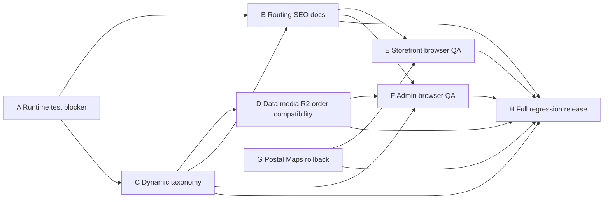

# End-to-End Handoff — Sitemap, Taxonomy, Data, UI, dan Release

Baseline audit: commit `8dab8cf` (`refactor: drop legacy static category routes...`).
Dokumen ini adalah handoff eksekusi untuk batch setelah audit, bukan izin untuk mengubah
runtime secara serentak. Semua agent wajib membaca `AGENTS.md`, `docs/MEMORY.md`,
`docs/PRODUCT-HANDOFF.md`, dan `docs/spec-final-session.md` sebelum bekerja.

## Batas keras

- Scope dokumen ini **docs/handoff dan koordinasi**. Handoff ini tidak menjalankan
  migration, deploy, atau perubahan produksi.
- Jangan memakai `migrate:fresh`, `migrate:refresh`, `db:wipe`, `TRUNCATE`, destructive
  seeder, `git reset --hard`, atau menimpa kerja agent lain.
- Setiap agent mulai dengan `git status`, bekerja pada file scope-nya sendiri, dan
  stage file secara eksplisit. Shared working tree berarti perubahan agent lain harus
  dipertahankan.
- Jangan melemahkan test untuk membuat suite hijau. Jika kontrak berubah, update SoT
  (API/schema/sitemap/docs) dan test yang memang stale dengan alasan tertulis.
- Tidak boleh menambah route, enum, field, JSON, alias, redirect, atau provider baru
  tanpa update docs canonical dan acceptance test.

## Sumber keputusan final

1. Keputusan owner dan `docs/spec-final-session.md` (keputusan lintas fitur).
2. `docs/PRODUCT-HANDOFF.md` (perilaku produk dan compatibility).
3. `docs/api-and-routes-ragil-aluminium.md`, `docs/database-schema-ragil-aluminium.md`,
   `docs/sitemap/*`, `config/sitemap.php`, dan `config/admin-sitemap.php` (contract teknis).
4. Runtime/tests pada baseline commit, untuk menemukan gap implementasi; runtime tidak
   mengalahkan keputusan owner tanpa keputusan eksplisit.

## Audit findings terverifikasi

### F1 — Full-suite test blocker: enam failure karena import model

Baseline audit full suite adalah **343 passed / 4560 assertions dengan 6 failures**. Enam failure tersebut berasal dari referensi `Product` tanpa `use App\Models\Product` pada test/fixture terkait. Ini adalah blocker runtime-test,
bukan alasan untuk mengubah kontrak katalog. Agent A harus mengisolasi nama test yang tepat,
menambah import minimal bila memang akar masalahnya, lalu menjalankan targeted dan full suite.

**Status:** OPEN, P0. **Owner:** Agent A.

### F2 — Route names dan canonical docs stale

`docs/api-and-routes-ragil-aluminium.md`, `docs/PRODUCT-HANDOFF.md`, `docs/sitemap/*`,
Ziggy declarations, dan beberapa test masih dapat menyebut route lama setelah commit
`8dab8cf` menghapus static `catalog.windows`, `catalog.doors`, dan `catalog.bouven`.
Selain itu, current `categoryShow()` aliases `/products/windows`, `/products/doors`, dan
`/products/bouven` masih merespons **HTTP 200 noncanonical**, bukan redirect. `config/sitemap.php`
dan `app/Support/CatalogTaxonomy.php` masih memiliki route names yang sudah dihapus.
Route list aktual, route name, href, sitemap, canonical/SEO, dan test harus menjadi satu
kontrak. Jangan menghidupkan kembali route yang sudah dihapus hanya demi test lama.

**Status:** OPEN, P0. **Owner:** Agent B.

### F3 — Removed static category references masih tersebar

Audit menemukan referensi lama di area berikut (setiap occurrence harus diklasifikasikan,
bukan dihapus membabi buta):

- `config/sitemap.php`;
- `app/Support/CatalogTaxonomy.php`, `app/Support/CategoryUrl.php`,
  `app/Support/PublicNavigation.php`, `app/Support/HomepagePromotions.php`;
- `resources/js/ziggy.d.ts`, `resources/js/types/ziggy-routes.d.ts`, dan
  `resources/js/pages/Admin/Announcements/Form.tsx`;
- `docs/PRODUCT-HANDOFF.md`, `docs/api-and-routes-ragil-aluminium.md`;
- `tests/Feature/CatalogSearchTest.php`, `CatalogRuntimeSchemaTest.php`,
  `ModelProdukPageTest.php`, `SitemapTest.php`, `HomepagePopularTest.php`, dan
  `tests/e2e/storefront.spec.ts`.

Canonical public slug final adalah Bahasa Indonesia: `jendela`, `pintu`, `boven`.
Legacy `/products/windows`, `/products/doors`, `/products/bouven` dan aliases lama
harus memiliki kebijakan eksplisit sebelum production: default audit saat ini adalah
removed/404 sesuai `8dab8cf`; jangan menambahkan redirect tanpa keputusan owner.

**Status:** OPEN, P0. **Owner:** Agent B, dengan input Agent C untuk taxonomy.

### F4 — Dynamic taxonomy belum benar-benar data-driven

Walaupun route slug dinormalisasi, taxonomy masih fixed di beberapa layer:

- `products.product_category` masih dibatasi enum/allowlist oleh migration
  `2026_08_10_100926_make_product_category_editable.php` dan validasi controller;
- `app/Http/Controllers/Admin/ModelProductController.php` masih memakai
  `Rule::in(['WINDOW', 'DOOR', 'BOUVEN'])` dan option hard-code;
- `app/Support/CatalogTaxonomy.php` memiliki order/route mapping fixed;
- `app/Support/CategoryUrl.php`, `CatalogLabels`, import/parser, dan seeder masih
  membawa daftar kategori lama;
- `database/seeders/DevPreviewCatalogSeeder.php` dan seeder terkait membuat asumsi
  kategori fixed.

Kebutuhan final: kategori baru dapat ditambah/diaktifkan/dinonaktifkan melalui data/admin
(import yang sesuai) tanpa menambah kode route/controller atau mengubah enum. Internal
product code, public slug, label, sort order, SEO metadata, dan active state harus punya
kontrak jelas serta tidak merusak snapshot order/media.

**Status:** OPEN, P0. **Owner:** Agent C.

### F5 — Migration normalization memiliki OR grouping/down asymmetry

`database/migrations/2026_08_16_000001_normalize_category_slugs_to_indonesian.php`
memakai kondisi `where(...)->orWhere(...)` yang perlu diaudit grouping dan scope-nya.
Arah `down()` tidak simetris terhadap `up()`, sehingga rollback/replay dapat mengubah baris
lebih luas atau meninggalkan campuran code/slug. Perbaikan harus forward-only untuk data
produksi: audit precondition, idempotency, row counts, duplicate/foreign-key safety, dan
jelaskan bahwa rollback kode bukan rollback data otomatis.

**Status:** OPEN, P0. **Owner:** Agent D untuk audit data/migration; Agent C menyetujui
model taxonomy. Tidak ada migrate production dalam handoff ini.

### F6 — Nama SKU dan nomor order belum satu keputusan pre-production

Docs/runtime/tests menggunakan lebih dari satu pola, antara lain public SKU opaque,
`RA-...` untuk nomor order pada Product Handoff, dan test legacy `ORD-...`. Final session
menyatakan keputusan RA/ORD harus dikunci sebelum production, bukan diselesaikan lewat
rewrite histori. Agent D membuat compatibility matrix untuk SKU parent/variant, order
number, URL, import/export, WhatsApp, tracking, dan test fixture; owner mengunci satu
format baru serta kebijakan legacy.

**Status:** OPEN, P0 sebelum production. **Owner:** Agent D, keputusan akhir owner.

### F7 — Google Maps rollback dan postal quality belum selesai

Commit/branch sebelumnya pernah menambah Google Geocoding sebagai fallback postal. Keputusan
final: Google Maps bukan sumber kode pos dan tidak boleh menjadi postal API contract.
Postal internal memakai dataset versioned berbasis Satu Data Indonesia/data.go.id dengan
cross-check Pos Indonesia, quality gate, coverage/integrity/checksum/review, dan activation
terkendali.

Field postal customer readonly. Mapping valid dapat mengisi otomatis; mapping kosong atau
belum terverifikasi menghasilkan blank + konfirmasi ulang alamat/pencarian wilayah.
Titik peta hanya konteks lokasi opsional. Manual review hanya untuk quote/provider failure.
Agent G harus memeriksa runtime/config/docs dan menghapus contract Google Maps yang masih
tersisa tanpa mengubah shipping math/J&T tracking.

**Status:** OPEN, P0. **Owner:** Agent G.

### F8 — UI visual gate belum lulus

Route smoke dan typecheck/build tidak menggantikan authenticated browser visual QA. Desktop
admin adalah prioritas; mobile cukup rapi/support dasar. Storefront dan admin perlu diuji
pada browser nyata untuk clipping/overflow, table/card width, spacing, action hierarchy,
loading/empty/error, keyboard focus, active nav, serta canonical category links.
Chrome/Edge/browser context yang tidak tersedia adalah blocker yang harus dilaporkan,
bukan alasan mengklaim visual pass.

**Status:** OPEN, P1/P0 release gate. **Owner:** Agent E storefront, Agent F admin.

## Final session invariants yang tidak boleh berubah

- Search deterministik tanpa AI; ukuran tinggi × panjang; exact lebih dahulu; ukuran dekat
  beralasan; typo/suggestion tidak mengarang varian atau membalik orientasi default.
- Share Produk memakai canonical URL + variant context, Native Share/WhatsApp/copy link,
  tanpa PII atau nomor tujuan tetap.
- Cart: tanpa selection aktif semua item masuk checkout; selection aktif hanya item checked;
  catatan per item pada checkout; tidak ada catatan alamat/global atau email.
- ETA customer memakai hasil display yang sudah menambah buffer +1 hari satu kali; jangan
  menampilkan atau menghitung formula buffer dua kali.
- Order: edit hanya sebelum konfirmasi; cancel customer hanya pending; tracking terverifikasi
  memindahkan delivered; tidak ada Tandai Sampai; status/GET handoff/PUT harus konsisten;
  customer/admin memakai satu Riwayat Pesanan dengan visibility berbeda.
- Retur customer melalui WhatsApp setelah Sampai/Selesai; admin mengisi case/form internal;
  reason wajib; resolution dapat refund, replacement, reship, kompensasi, selisih, ongkir,
  atau tanpa kompensasi; issue internal dan bukan retur.
- Performa Toko top-level, 15 KPI, snapshot order item, product identity berbeda dari unit
  qty; return metric hanya barang benar-benar kembali dan adjustment/resolution terdokumentasi.
- Media Library global berbeda dari media/project Hasil Pemasangan; satu project dapat
  multi-produk; lifecycle/caption/status terpisah. Review customer verified: admin tidak
  mengubah teks customer, boleh tambah media/moderasi/admin review tanpa duplikasi.
- Voucher diterapkan setelah harga Promo/Flash Sale efektif; nominal atau persen; minimum
  opsional; stacking per voucher; dapat dikombinasikan dengan subsidi ongkir. Flash Sale
  dapat menargetkan variasi sesuai kontrak.
- Dashboard tanpa hamburger; Performa Toko top-level; Import Performance di Import; Log
  Aktivitas di Akun & Sistem; filter lanjutan tidak memenuhi sidebar; notifikasi actionable.
- WhatsApp berjalan independen dari login admin; email fallback tidak ada; archive transaksi,
  server-side validation/idempotency, PII/secret redaction tetap wajib.

## Execution handoff dan batas scope agent

### Agent A — Runtime test blocker

**Scope:** `tests/`, test support/fixtures yang langsung diperlukan untuk enam failure,
dan hanya import/use/reference minimal yang terbukti akar masalahnya. Jalankan targeted
failure lalu full PHPUnit. Reconcile test lama hanya bila kontrak `8dab8cf` memang berubah,
dengan alasan di report.

**Tidak boleh:** mengubah route/taxonomy runtime, migration data, UI, snapshot production,
atau melemahkan assertion untuk hijau palsu.

**Acceptance:** enam failure terisolasi hilang; full PHPUnit dapat dijalankan dan hasilnya
0 failure atau daftar blocker baru yang reproducible; `git diff --check` bersih.

### Agent B — Canonical routing, SEO, dan docs

**Scope files/area:** `routes/web.php`, `routes/api.php` bila route alias memang harus
selaras, `config/sitemap.php`, `config/admin-sitemap.php` bila relevan, `docs/sitemap/*`,
`docs/api-and-routes-ragil-aluminium.md`, `docs/PRODUCT-HANDOFF.md`, Ziggy declarations,
canonical/SEO references, dan tests route/sitemap yang stale.

**Deliverable:** satu matrix route name → URL → controller → sitemap/SEO → status legacy.
Canonical Indonesian slug dipakai konsisten; old static names tidak diam-diam hidup lagi.
Jika route alias dipertahankan untuk compatibility, keputusan owner, redirect/404, test,
dan docs harus eksplisit.

**Tidak boleh:** mendesain taxonomy DB baru atau mengedit Product/Import service; koordinasi
ke Agent C hanya lewat contract/matrix.

**Acceptance:** `route:list` dan docs cocok; sitemap tidak menyebut removed route; canonical
href/JSON/Ziggy/test konsisten; tidak ada broken named route pada halaman publik/admin.

### Agent C — Dynamic taxonomy: DB/import/admin

**Scope files/area:** taxonomy/category migration forward-only, model/repository/service,
`CatalogTaxonomy`, `CategoryUrl`/labels, `CatalogController`/`PageController`, import/parser,
`ModelProductController`, category admin UI, seeders dan taxonomy tests.

**Deliverable:** category data menjadi source; slug/label/code/sort/active/SEO metadata
terdefinisi; kategori baru tidak memerlukan route/controller code; import/admin validation
mengikuti data aktif; existing product/order/media snapshot aman.

**Tidak boleh:** mengubah sitemap/SEO policy secara sepihak, mengubah order/SKU format,
atau menjalankan migration production. Agent C menyediakan route contract ke B dan data
precondition ke D.

**Acceptance:** tambah kategori baru via data path + import/admin test tanpa source-code
allowlist; deactivate category tidak memutus historical product/order; category URL,
model hub, filters, search, seeders, dan admin form lulus test.

### Agent D — Data, media/R2, migration, dan order compatibility

**Scope files/area:** migration audit/forward migration, schema/data integrity, product/order
snapshot, import/media pipeline, R2 references, SKU/order compatibility matrix, data audit
scripts/tests. Fokus khusus F5/F6; media tidak boleh membaca katalog live untuk histori order.

**Deliverable:** OR grouping/up/down/asymmetry audit; idempotent precondition/row-count report;
SKU parent/variant dan order number compatibility; media/product/order historical snapshot;
R2 object/DB relation tidak orphan oleh taxonomy migration.

**Tidak boleh:** mengubah route slug/sitemap, mengganti taxonomy UX, atau deploy/migrate prod.
Migration hanya di-pretend/test database terisolasi setelah review.

**Acceptance:** migration review menunjukkan scope tepat dan aman; order history tetap terbaca
meski product/category berubah; media R2/reference integrity teruji; RA/ORD compatibility
matrix disetujui owner atau blocker eksplisit.

### Agent E — Storefront UI dan browser QA

**Scope files/area:** public React/TSX/CSS, public layouts, search/share/cart/checkout/address,
tracking/order history, canonical category links, accessibility, dan browser smoke/screenshot.

**Deliverable:** desktop/mobile states untuk loading/empty/error/retry; no clipping/overflow;
postal readonly + retry state; ETA display +1 sekali; share fallback; cart note semantics;
canonical Indonesian URLs; no fake tracking/quote.

**Tidak boleh:** mengubah controller/API/database/route policy; bila contract backend salah,
laporkan blocker ke B/G, jangan mock data.

**Acceptance:** authenticated/guest browser smoke pada target viewport; critical flows dapat
diulang; screenshot evidence atau blocker environment yang jelas; typecheck/lint/build
bersih bila UI disentuh.

### Agent F — Admin UI dan browser QA

**Scope files/area:** admin pages/layout/sitemap presentation: dashboard, navigation, products,
import/media/installations, orders/detail/status/shipping/return, reviews/moderation, voucher/
flash, notifications/activity/settings/performance.

**Deliverable:** desktop-first workflow; no dashboard hamburger; Performa Toko top-level;
advanced filters in order flow; actionable notification; order timeline/action hierarchy;
Media vs Hasil Pemasangan scope; empty/loading/error/permission/keyboard states.

**Tidak boleh:** mengubah business rules/API/schema atau menutupi broken route dengan fake
props. Contract mismatch dikirim ke B/C/G.

**Acceptance:** browser screenshots/route smoke untuk halaman prioritas; no clipping/overflow,
active nav/parent/breadcrumb valid, action/status sesuai contract, typecheck/lint/build bersih.

### Agent G — Postal dan Maps rollback

**Scope files/area:** location picker/checkout address UI, postal dataset repository/import,
provider/config/controller route yang khusus Maps, API/schema/docs terkait postal, quality-gate
and retry/manual-review states.

**Deliverable:** Google Maps postal/geocoding contract dihapus atau di-rollback; tidak ada key
Google di contract; internal dataset quality gate + Satu Data Indonesia baseline + Pos Indonesia
cross-check; postal readonly; missing/unverified mapping → blank + full-address reconfirm/retry;
manual review hanya quote/provider failure; optional pin tidak memasok postal.

**Tidak boleh:** mengubah J&T tracking event/status, shipping math/subsidy rules, order lifecycle,
atau menambah provider baru. Jangan migration/deploy production.

**Acceptance:** `rg` tidak menemukan API/key Google postal; API/docs/runtime agree; mapping quality
states dan retry terbukti test; quote failure/manual review tetap utuh; no postal code from pin.

### Agent H — Full regression dan release readiness

**Scope:** QA orchestration setelah A–G: full PHPUnit, frontend typecheck/lint/test/build,
route/sitemap diff, migration `--pretend`/schema audit, focused browser smoke, docs diff.

**Tidak boleh:** memperbaiki dengan perubahan lintas scope tanpa owner/agent handoff; tidak
menjalankan production migration/deploy, tidak menyentuh data prod.

**Acceptance release gate:** full suite hijau; typecheck/lint/build hijau; canonical route,
sitemap, taxonomy, postal, order/SKU, media/R2, and docs cross-check; no unreviewed migration;
visual evidence atau browser blocker tercatat; `git diff --check` bersih; working tree hanya
menyisakan perubahan yang ditugaskan/di-commit.

## Dependency DAG

Urutan minimum: **A → C → (B dan D paralel setelah contract C) → G → (E dan F) → H**.
B boleh mengaudit docs sambil A berjalan, tetapi perubahan canonical slug tidak boleh ditutup
sebelum C memberi taxonomy matrix. E/F tidak boleh menyatakan visual pass sebelum B/C/G
memberi route/postal contract final.

## Cross-agent handoff checklist

- [ ] Agent A mengirim daftar enam test failure dan commit minimal.
- [ ] Agent C mengirim taxonomy matrix (code/slug/label/active/sort/SEO) ke B/D.
- [ ] Agent B mengirim route/SEO/sitemap matrix dan keputusan legacy alias.
- [ ] Agent D mengirim migration precondition/row-count, snapshot, dan RA/ORD matrix.
- [ ] Agent G mengirim bukti rollback Maps, postal quality/retry state, dan docs/API parity.
- [ ] Agent E/F mengirim browser evidence atau environment blocker yang reproducible.
- [ ] Agent H menutup regression report dan memastikan no production migration/deploy.

## Format laporan setiap agent

**SCOPE** — area/file yang disentuh dan yang sengaja tidak disentuh.
**ROOT_CAUSE** — gap/error terverifikasi, bukan asumsi.
**CHANGE** — perubahan dan commit hash; migration/deploy status eksplisit.
**SPEC_IMPACT** — docs/API/schema/sitemap yang diselaraskan, atau “Spec tidak berubah”.
**TEST_STATUS** — command, hasil, evidence, failure/blocker, dan coverage limitation.
**OPEN RISKS** — dependency atau keputusan owner yang belum terkunci.

## Status handoff

Dokumen ini hanya menambah rencana dan acceptance criteria. Tidak ada runtime code, migration,
production data, atau deploy yang diubah oleh pembuatan handoff ini.
